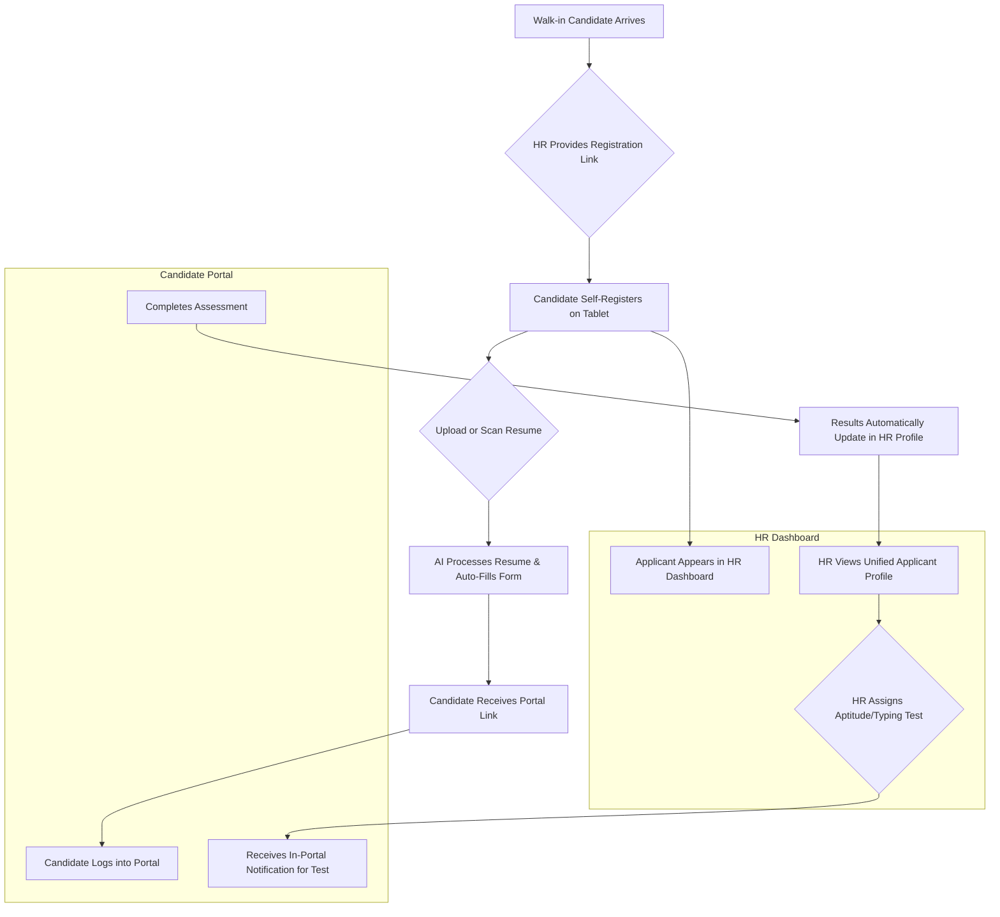

# HR360+ Platform: The All-in-One AI-Powered HR Solution

Welcome to HR360+, the enterprise-grade platform designed to streamline and automate the entire HR lifecycle for a modern multinational corporation. This application leverages the power of Generative AI to enhance recruitment, employee management, and strategic HR operations.

## Core Hiring Workflow Diagram

The following diagram illustrates the seamless, AI-powered process for handling a walk-in job applicant, from registration to assessment.

---

## Deployment

To deploy this application to a hosting provider like Vercel, you **must** configure the environment variables correctly. Please see the detailed instructions in [DEPLOYMENT.md](./DEPLOYMENT.md).

---

## Key Features & Modules

The platform is organized into intuitive modules that mirror the core functions of a high-performing HR department.

### 🚀 Talent Acquisition

-   **Live Job Postings:** A central dashboard to track all open positions your company has posted across different platforms like LinkedIn, Naukri, and your company website.
-   **Campus Drive & Internship Aggregator:** Manage large-scale campus recruitment drives and internship programs. Invite colleges, track applicants, and manage the entire pipeline from a single view.
-   **AI-Powered Applicant Registration:** A self-service portal for walk-in candidates to register by uploading or taking a photo of their resume. AI automatically parses the data and fills the form.
-   **Unified Applicant Profiles:** A 360-degree view of every candidate, showing contact information, application status, and all assessment results (Aptitude, Typing, etc.) in one place.
-   **GPT-Powered Match Score:** Instantly score a candidate's resume against a job description for skills, experience, and overall fit.
-   **Integrated Assessment Center:**
    -   **Role-Based Aptitude Tests:** Generate dynamic tests (Logical, English, Comprehensive) with questions tailored to the specific job role.
    -   **Picture Puzzles:** AI-generated visual puzzles are included in tests to assess logical reasoning.
    -   **Typing Tests:** A dedicated module to assess typing speed and accuracy for roles like chat support.
    -   **AI Interview Bot:** Auto-generates interview questions based on the job and resume, and can evaluate candidate responses.
    -   **Video Resume Analyzer:** Analyzes video submissions to rate candidate confidence, clarity, and tone.

### 📄 Documentation & Communication

-   **Document Generator:** Instantly create standardized, error-free HR documents like offer letters and internal memos using AI.
-   **AI Email Composer:** An intelligent assistant to draft personalized, professional emails for various HR communications.
-   **Grievance Hub:** A secure, anonymous, and trackable ticketing system for employees to raise concerns with HR or legal departments.

### 📈 Employee Management

-   **Live Employee Status Grid:** A real-time dashboard showing the work status (Remote, Office, Leave, Probation) of all employees across the organization.
-   **Career Path Predictor:** Uses AI to forecast potential career growth paths for current employees, including future roles, skill upgrades, and suggested mentors.
-   **Recognition & Rewards Dashboard:** An automated system to detect "kudos" and achievements, award points, and manage a redeemable rewards program.
-   **Sentiment & Culture Fit Analysis:**
    -   **Sentiment Analyzer:** Processes text from exit interviews and feedback forms to detect morale, burnout, and toxicity.
    -   **Culture Fit Predictor:** Assesses candidate alignment with company values for better hiring decisions.

### ⚙️ Automation & Compliance

-   **HR Workflows:** A visual process manager to automate multi-step workflows like employee onboarding, offboarding, and leave approvals.
-   **Smart 48-Hour Resume Alert:** An automated workflow that alerts HR if a new resume has not been reviewed within 48 hours.
-   **Compliance Center:** A central repository to manage HR policies, track employee acknowledgments, and monitor document expiry dates.

### 📊 Intelligence & Tools

-   **Predictive Analytics Dashboard:** Provides AI-driven insights on key metrics like employee attrition, burnout heatmaps, and salary benchmarks.
-   **Mobile & WhatsApp HR Bot:** An AI assistant that allows employees to self-serve for common requests like leave, payslips, and job status inquiries.

## Getting Started

To explore the platform, simply start the application and navigate to the main [Dashboard](/) to get an overview of all the modules and key metrics.
